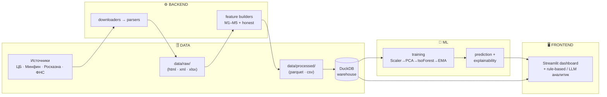

# 🛰️ RU Liquidity Sentinel

> Система раннего предупреждения о **стрессе ликвидности** рублёвого денежного рынка, разработанная для ПСБ. 


---

## 🎯 Что это и зачем

**Liquidity Stress Index (LSI)** — единый числовой индикатор напряжённости рублёвой ликвидности по шкале **0–100**, который ежедневно собирается из публичных данных ЦБ, Минфина, Росказны и ФНС.

Проблема: признаки дефицита ликвидности рассыпаны по десяткам разнородных источников (резервы, ставки, аукционы РЕПО/ОФЗ, баланс ЦБ, налоговый календарь). Аналитик физически не может держать их все в голове и вовремя заметить, что «складывается стресс».

LSI решает это так:
- **сводит** сигналы пяти каналов рынка в один индекс;
- **подсвечивает** аномалии без размеченных кризисов — модель **обучается без учителя** (стресс = статистически редкое, аномальное состояние);
- **объясняет** себя — для каждой даты видно, какой модуль и какой признак двигают индекс;
- **раннее предупреждение** — на бэктесте детектирует исторические эпизоды (Декабрь 2014, Февраль–март 2022, Август 2023).

> 🔍 **Не «чёрный ящик».** LSI — это прозрачное PCA-приближение нагрузки модулей, а не причинная модель. Каждый сигнал трассируется до конкретного признака и источника.

---

## 🚀 Быстрый старт

```bash
# 1. Зависимости
pip install -r requirements.txt

# 2. Bootstrap (один раз, нужен интернет): скачать источники → пересчитать фичи →
#    обучить LSI → наполнить витрину DuckDB. Папки data/ и models/ НЕ версионируются,
#    поэтому на свежем клоне их нужно собрать этим шагом.
python -m backend.src.pipelines.refresh_pipeline

# 3. Запустить дашборд
streamlit run dashboard/app.py
```

> ℹ️ **Данные и модели не в git.** `data/` и `models/` — регенерируемые артефакты (в `.gitignore`), чтобы каждое обновление не пушило десятки мегабайт. Bootstrap-команда выше восстанавливает их из публичных источников. В репозитории остаётся только семя налогового календаря ФНС (`data/raw/tax_calendar/`).

Обновить данные до последней доступной даты позже можно прямо из дашборда: **Инструменты → Данные ⚙️ → Полное обновление** (скачивание из источников → пересчёт фич → переобучение LSI → обновление витрины).

---

## 🏛️ Архитектура

Система разделена на **четыре слоя** — каждый отвечает за одну зону ответственности и заменяем независимо от других.



**Почему именно так:**

| Слой | Ответственность | Почему отделён |
|------|-----------------|----------------|
| 🗄️ **Data** | загрузка, парсинг, хранение | источники меняют форматы — изоляция парсинга не ломает остальное. Витрина **DuckDB** — единый «source of truth» для чтения дашбордом (быстро, без ORM, parquet-нативно) |
| ⚙️ **Backend** | фичи и бизнес-логика | один **central feature builder** (`honest_feature_builder`) — единственный источник правды по признакам, чтобы прод и исследование считали идентично |
| 🧠 **ML** | обучение, скоринг, объяснимость | модель и пороги вынесены из UI — их можно переобучать и калибровать независимо |
| 🖥️ **Frontend** | визуализация и аналитика | Streamlit-страницы только читают готовые данные/ответы — никакой тяжёлой логики в UI |

---

## 🧠 ML-пайплайн

LSI считается **без учителя** — стресс не размечается вручную, а определяется как статистическая аномалия. Один и тот же конвейер применяется к двум окнам обучения.

```text
признаки  →  StandardScaler  →  PCA(10)  →  IsolationForest(contamination=0.06)
          →  −decision_function  →  EMA(α=0.05)  →  MinMaxScaler(0–100)  →  clip(0,100)
```

| Шаг | Зачем |
|-----|-------|
| **StandardScaler** | привести разномасштабные признаки (рубли, %, флаги) к Z-оценкам |
| **PCA (10 компонент)** | убрать мультиколлинеарность, сжать сигнал в главные оси напряжённости |
| **Isolation Forest** | обнаружение аномалий без учителя — изолирует редкие состояния рынка |
| **EMA (α=0.05)** | сглаживание: индекс реагирует на тренд, а не на однодневный шум |
| **MinMax → clip** | финальная человекочитаемая шкала 0–100 |

### Две модели: Global и Local

| Индекс | Окно обучения | Назначение |
|--------|---------------|-----------|
| 🌍 **LSI Global** | вся история с 2014 | исторически откалиброванный «абсолютный» уровень стресса |
| 📍 **LSI Local** | скользящие **365 дней** | чувствителен к аномалиям относительно недавнего режима |

Итоговый `LSI_Index` берёт **Local** (где он доступен) и откатывается к **Global** на ранней истории.

### «Честная» переработка признаков (рефакторинг)

В ходе рефакторинга набор признаков был пересобран по принципу **«в индекс входит только то, что действительно несёт сигнал стресса»**: убраны производные/«подсказывающие» фичи, добавлены недостающие (например, волатильность спреда). Итоговый баланс вкладов сбалансирован по каналам:

```
M1 ≈ 23%   M2 ≈ 26%   M3 ≈ 30%   M5 ≈ 20%   M4 = overlay (вне PCA)
```

### Объяснимость

Для любой даты доступны: **вклады модулей** (M1/M2/M3/M5), **топ-драйверы** (конкретные признаки), **декомпозиция по главным компонентам**. Метрика — EVR-attribution (`|scaled|·structural_weight`, нормировано к 100%): не SHAP и не причинность, а прозрачная относительная нагрузка на индекс.

### Пороговые профили (светофор)

| Профиль | 🟢 Зелёный | 🟡 Жёлтый | 🔴 Красный | Когда применять |
|---------|-----------|----------|-----------|----------------|
| `honest` *(default)* | < 40 | 40–60 | ≥ 60 | сбалансированный индекс, пороги p80/p95 |
| `conservative` | < 40 | 40–70 | ≥ 70 | меньше ложных тревог |

---

## 🧩 Модули системы

Каждый модуль описывает один канал денежного рынка. В индекс входят **M1, M2, M3, M5**; **M4 — overlay** (контекст, не двигает индекс).

| Модуль | Канал | Что ловит | Honest-признаки (вход в LSI) |
|--------|-------|-----------|------------------------------|
| 🏦 **M1** | Обязательные резервы и RUONIA | поведение банков в периоды усреднения резервов, аномалии спреда и ставки | аномальность спреда / относит. спреда / нагрузки резервов / RUONIA, **волатильность спреда** |
| 📋 **M2** | Аукционы РЕПО ЦБ | спрос банков на рублёвую ликвидность от регулятора | факт аукциона, флаг спроса, аномальность переподписки, спред отсечения, активность short-РЕПО |
| 📜 **M3** | Аукционы ОФЗ (Минфин) | спрос на госдолг как индикатор свободных средств | event-aware переподписка, доля размещения, премия доходности к ключевой, возраст/несостоявшийся аукцион |
| 📅 **M4** | Налоговый календарь (ФНС) | **overlay** — календарное налоговое давление | — *(вне PCA; отдаётся как контекст рядом с LSI)* |
| 💧 **M5** | Ликвидность ЦБ / ЕКС | баланс операций ЦБ с банками и средства Казначейства | требования / обязательства ЦБ, постоянное РЕПО и обеспеченные кредиты, заявители Росказна (Local) |

> 💡 **Почему M4 — overlay?** Налоговый календарь детерминирован (известен заранее). Включённый в PCA, он давал ложную сезонную «подсветку» индекса. Теперь он показывается как контекст для интерпретации, но не влияет на значение LSI.

---

## 🗄️ Источники данных

| Источник | Что берём |
|----------|-----------|
| **ЦБ РФ** | обязательные резервы, RUONIA, ключевая ставка, аукционы РЕПО, дневная ликвидность банковского сектора, бюджетные средства в банках |
| **Минфин России** | первичные аукционы ОФЗ |
| **Росказна** | размещение средств ЕКС на банковских депозитах (XML операционного дня) |
| **ФНС** | налоговый календарь (overlay) |

Сырьё скачивается `downloaders/`, парсится `parsers/`, агрегируется в признаки и единый `final_ml_dataset`, из которого собирается honest-датасет и витрина DuckDB. Данные покрывают период **с 2014 года** и обновляются кнопкой «Данные ⚙️».

---

## 🖥️ Дашборд

```bash
streamlit run dashboard/app.py
```

| Страница | Описание |
|----------|----------|
| 🏠 **Обзор системы** | LSI Local/Global, светофор, выбор порогового профиля, вклады модулей |
| 📡 **Сводные сигналы** | сигналы M1–M5 и LSI на одной оси времени |
| 🏦 **M1 — Резервы** | honest-драйверы + сырой контекст + live-вклад в LSI |
| 📋 **M2 — Репо ЦБ** | аукционы РЕПО, переподписка, спред отсечения |
| 📜 **M3 — ОФЗ** | event-aware спрос и доходности аукционов ОФЗ |
| 📅 **M4 — Налоги** | overlay: налоговый контекст (вклад в LSI = 0) |
| 💧 **M5 — Ликвидность** | баланс операций ЦБ, standing facilities, Росказна |
| 🔍 **Качество данных** | свежесть и полнота по модулям |
| ⚙️ **Данные** | обновление источников → пересчёт → витрина (одной кнопкой) |
| 🧠 **Аналитик** | автокомментарий LSI + вопрос-ответ (rule-based / опц. LLM) |

Страница **Аналитик** работает без внешнего API в rule-based режиме; LLM подключается опционально через `.env` (`OPENAI_API_KEY`, `LLM_BASE_URL`).

---

## 🛠️ Технологии

| Категория | Стек |
|-----------|------|
| **Данные** | pandas · pyarrow · **DuckDB** · requests · openpyxl |
| **ML** | scikit-learn (IsolationForest · PCA · StandardScaler · MinMaxScaler) · numpy · scipy |
| **Дашборд** | Streamlit · Plotly |
| **Аналитик** | rule-based · опц. OpenAI-совместимый LLM · python-dotenv |
| **Артефакты** | joblib (обученные пайплайны) |
| **Python** | 3.11+ |

---

## 📁 Структура проекта

```text
RuLiquiditySentinel/
├── backend/src/
│   ├── downloaders/        # скачивание сырья (ЦБ · Минфин · Росказна · ФНС)
│   ├── parsers/            # сырьё → DataFrame
│   ├── db/warehouse.py     # витрина DuckDB + слой свежести (manifest)
│   ├── pipelines/          # m1–m5 · final · honest · refresh (оркестратор)
│   └── services/
│       ├── honest_feature_builder.py   # central source of truth по признакам
│       ├── honest_lsi_training.py      # обучение honest Global/Local
│       ├── honest_lsi_prediction.py    # скоринг + объяснимость
│       ├── lsi_training_service.py     # ядро ML-пайплайна
│       ├── lsi_thresholds.py           # пороговые профили светофора
│       └── lsi_commentary_service.py   # rule-based + LLM комментарии
├── dashboard/
│   ├── app.py              # точка входа Streamlit (навигация)
│   ├── pages/              # страницы 00–09
│   ├── components/         # переиспользуемые виджеты (charts · honest · metrics)
│   └── data/loader.py      # чтение из витрины + кеширование
├── data/
│   ├── raw/                # сырьё (частично в .gitignore)
│   ├── processed/          # parquet/csv признаки и датасеты
│   └── warehouse.duckdb    # витрина (генерируется, в .gitignore)
├── models/                 # обученные пайплайны (*.joblib)
├── docs/                   # подробная техническая документация
├── lab/ · ml/              # исследовательские ноутбуки и утилиты
└── requirements.txt
```

---

## 📚 Дальше

Этот README — взгляд «с высоты птичьего полёта». Подробная техническая документация — в папке [`docs/`](docs/) ([оглавление](docs/README.md)):

| Слой / раздел | Документ | О чём |
|---------------|----------|-------|
| 🖥️ Frontend | [`docs/frontend/README_FRONTEND.md`](docs/frontend/README_FRONTEND.md) | Streamlit: страницы, загрузчики, best practices, `session_state` |
| ⚙️ Backend | [`docs/backend/README_BACKEND.md`](docs/backend/README_BACKEND.md) | сервисы, хранилище + DuckDB, API таблиц, паттерны добавления |
| 🧠 ML | [`docs/ml/README_ML.md`](docs/ml/README_ML.md) | пайплайн, Global/Local, whitelist, объяснимость, добавление фичи |
| 🗄️ Data | [`docs/data/README_DATA.md`](docs/data/README_DATA.md) | сырые таблицы, источники, скрейперы и их quirks |
| 🧩 Модули | [`docs/modules/`](docs/modules/) | M1–M5: экономика · пул фич · whitelist · методика |
