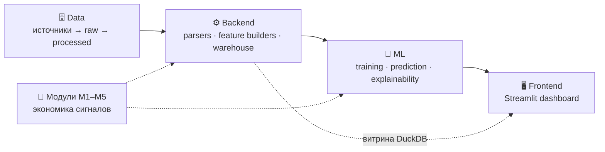

# 📚 Документация RU Liquidity Sentinel

Полная техническая документация системы по слоям. Высокоуровневый обзор «с высоты птичьего полёта» — в [корневом README](../README.md); здесь — детали каждого слоя и модуля.

---

## 🗺️ Навигация

### Слои системы

| Слой | Документ | О чём |
|------|----------|-------|
| 🖥️ **Frontend** | [`frontend/README_FRONTEND.md`](frontend/README_FRONTEND.md) | архитектура Streamlit, страницы, загрузчики, best practices, `session_state` |
| ⚙️ **Backend** | [`backend/README_BACKEND.md`](backend/README_BACKEND.md) | сервисный слой, файловое хранилище + DuckDB, API таблиц, паттерны добавления |
| 🧠 **ML** | [`ml/README_ML.md`](ml/README_ML.md) | пайплайн, Global/Local, whitelist, добавление фичи, объяснимость (EVR-attribution) |
| 🗄️ **Data** | [`data/README_DATA.md`](data/README_DATA.md) | сырые таблицы и колонки, источники, скрейперы и их quirks |

### Аналитические модули

| Модуль | Документ | Канал |
|--------|----------|-------|
| 🏦 **M1** | [`modules/M1_Reserves.md`](modules/M1_Reserves.md) | Обязательные резервы и RUONIA |
| 📋 **M2** | [`modules/M2_Repo.md`](modules/M2_Repo.md) | Аукционы РЕПО ЦБ |
| 📜 **M3** | [`modules/M3_OFZ.md`](modules/M3_OFZ.md) | Аукционы ОФЗ (Минфин) |
| 📅 **M4** | [`modules/M4_Tax.md`](modules/M4_Tax.md) | Налоговый календарь (overlay) |
| 💧 **M5** | [`modules/M5_Liquidity.md`](modules/M5_Liquidity.md) | Ликвидность ЦБ / ЕКС |

Каждый модульный документ построен по единой структуре: **описание (экономика) → полный пул фичей → whitelist + обоснование → методика расчёта**.

---

## 🧭 С чего начать

- **Хочу понять, что это и зачем** → [корневой README](../README.md)
- **Разрабатываю страницу/виджет дашборда** → [Frontend](frontend/README_FRONTEND.md)
- **Добавляю источник данных или колонку** → [Backend](backend/README_BACKEND.md) + [Data](data/README_DATA.md)
- **Меняю модель или добавляю фичу в LSI** → [ML](ml/README_ML.md) + нужный [модуль](modules/)
- **Разбираюсь в экономике сигнала** → [модули M1–M5](modules/)

---

## 🏛️ Как связаны слои

> Документация поддерживается в актуальном состоянии после рефакторинга (honest-признаки, DuckDB-витрина, overlay M4). Дорефакторные материалы удалены, чтобы не вводить в заблуждение.
