# ⚙️ Backend — сервисный слой, данные и ML

Документация слоя **Backend** системы RU Liquidity Sentinel: архитектура сервисов, файловое хранилище + витрина DuckDB, паттерны добавления таблиц/колонок и API работы с таблицами.

> Помодульные разборы (экономика, полный пул фич, whitelist, методика расчёта) — в
> [`../modules/`](../modules/): [M1](../modules/M1_Reserves.md) · [M2](../modules/M2_Repo.md) ·
> [M3](../modules/M3_OFZ.md) · [M4](../modules/M4_Tax.md) · [M5](../modules/M5_Liquidity.md).
> Калибровка порогов и бэктест задокументированы в коде: `lsi_threshold_calibration_service.py`,
> `honest_lsi_backtest.py`.

---

## 1. Архитектура

Backend — конвейер «сырьё → признаки → датасет → модель → ответ». Каждый этап изолирован в своём пакете.

```
backend/src/
├── downloaders/            # скачивание сырья с сайтов источников → data/raw/
├── parsers/                # сырьё (html/xml/xlsx) → нормализованный CSV в data/processed/
├── services/               # вся бизнес-логика
│   ├── mN_dataset_builder.py   # очистка/сборка датасета модуля
│   ├── mN_feature_builder.py   # инжиниринг признаков модуля (MAD, флаги, лаги)
│   ├── final_dataset_builder.py# слияние M1–M5 в дневной final_ml_dataset
│   ├── honest_feature_builder.py # ⭐ central source of truth: honest-признаки + whitelist
│   ├── lsi_training_service.py   # ядро ML-пайплайна (fit_lsi_artifact)
│   ├── honest_lsi_training.py     # обучение honest Global/Local
│   ├── honest_lsi_prediction.py   # скоринг + объяснимость + контракт дашборда
│   ├── lsi_thresholds.py          # пороговые профили светофора
│   ├── lsi_prediction_service.py  # legacy-скоринг (старый прод)
│   └── lsi_commentary_service.py  # rule-based + LLM комментарии
├── db/
│   └── warehouse.py        # витрина DuckDB + manifest свежести
└── pipelines/              # оркестрация
    ├── m1…m5_pipeline.py   # download → parse → dataset → features
    ├── final_dataset_pipeline.py
    ├── honest_lsi_pipeline.py     # honest-датасет + обучение моделей
    └── refresh_pipeline.py        # ⭐ полный апдейт «одной кнопкой»
```

### Конвейер одного модуля

```mermaid
flowchart LR
    DL["downloaders/<br/>download_X()"] --> RAW["data/raw/X/"]
    RAW --> PRS["parsers/<br/>parse_X() + save_csv()"]
    PRS --> CSV["data/processed/X.csv"]
    CSV --> DS["services/<br/>build_mN_dataset()"]
    DS --> FE["services/<br/>build_mN_features()"]
    FE --> FEAT["mN_features.parquet"]
    FEAT --> FIN["final_dataset_builder<br/>build_final_ml_dataset()"]
    FIN --> HON["honest_feature_builder<br/>build_honest_dataset()"]
    HON --> WH[("warehouse.duckdb")]
```



**Конвенции сервисов:** каждый модуль экспортирует пару `build_*()` (возвращает данные) и `save_csv()/save_parquet()` (пишет в `data/processed/`). Пути — через `PROJECT_ROOT = Path(__file__).resolve().parents[3]`. Никаких побочных эффектов в `build_*` — только чтение входов и возврат результата.

---

## 2. Хранилище данных

Базы данных-сервера нет. Хранилище **двухуровневое**:

| Уровень | Где | Назначение |
|---------|-----|-----------|
| **Файловое** | `data/raw/` (сырьё) → `data/processed/` (`*.csv` / `*.parquet`) | канонический результат пайплайнов; коммитится ключевой набор |
| **Витрина** | `data/warehouse.duckdb` (встроенный DuckDB) | единый **source of truth для чтения** дашбордом + слой свежести; **генерируется**, в `.gitignore` |

**Почему так.** Пайплайны исторически пишут parquet/csv — это их контракт, и валидированный honest-feature-build на нём проверен «до байта». Витрина не заменяет файлы, а служит **сервинг-слоем**: она наполняется из processed-файлов одной функцией `sync_processed_to_warehouse()` и отдаёт данные дашборду быстро и единообразно (DuckDB колоночный, нативно читает pandas/parquet, без ORM).

### Поток записи/чтения

```
pipelines → пишут data/processed/*.parquet
          → sync_processed_to_warehouse() → грузит в warehouse.duckdb (+ manifest)
dashboard → читает ТОЛЬКО из warehouse (read_table, fallback на parquet)
```

### ⚠️ Формат даты

Колонка `date` в processed-файлах хранится **строкой** (часть источников — ISO `YYYY-MM-DD`, часть — `DD-MM-YYYY`). Поэтому:
- при чтении всегда нормализуйте дату (`warehouse._to_datetime` или `loader._parse_dates`: ISO → `DD-MM-YYYY` → dayfirst);
- `final_dataset_builder._format_dates_for_output` форматирует даты в ISO **перед сохранением**.

---

## 3. API работы с таблицами

Модуль `backend/src/db/warehouse.py` — единая точка доступа к витрине.

### Чтение

```python
from backend.src.db import warehouse as wh

df = wh.read_table("honest_ml_dataset")   # → pandas.DataFrame
                                           # если таблицы нет — fallback на processed-файл
wh.has_table("m1_features")                # → bool
wh.list_tables()                           # → ['m1_features', 'final_ml_dataset', ...]
```

### Запись (перезапись таблицы)

```python
wh.write_table("my_table", df, source="my_table.parquet")
# CREATE OR REPLACE TABLE + обновление manifest (строки, даты, updated_at)
```

### Синхронизация из processed-файлов

```python
mani = wh.sync_processed_to_warehouse()    # грузит все PROCESSED_TABLES, возвращает manifest
mani = wh.sync_processed_to_warehouse(["m5_features", "honest_ml_dataset"])  # выборочно
```

### Свежесть

```python
wh.manifest()   # DataFrame: table_name, row_count, col_count, date_min, date_max, source, updated_at
```

### «Мердж» / апдейт

Текущая модель — **полная перезапись** таблицы (`CREATE OR REPLACE`), потому что пайплайны идемпотентно пересобирают весь датасет. Для инкрементального дополнения паттерн такой: прочитать → склеить pandas-ом → записать обратно:

```python
old = wh.read_table("repo")
merged = (pd.concat([old, new_rows])
            .drop_duplicates(subset=["date"], keep="last")
            .sort_values("date"))
wh.write_table("repo", merged, source="repo.csv")
```

> На практике инкремент не нужен: «Данные ⚙️ → Полное обновление» перекачивает источники и пересобирает таблицы целиком, после чего `sync_processed_to_warehouse()` заливает их в витрину.

---

## 4. Паттерны добавления

### 4.1 Добавить колонку в существующий модуль

Признаки модуля рассчитываются в `services/mN_feature_builder.py`. Чтобы новый признак дошёл до LSI:

1. **Посчитать** колонку в `build_mN_features()` (например, новый MAD-скор или флаг).
2. **Пересобрать** модуль: `python -m backend.src.pipelines.mN_pipeline` (или кнопкой обновления).
3. **Пробросить в final.** В `final_dataset_builder._prepare_mN()` колонка попадает в `final_ml_dataset`. Все модули получают префикс `mN_`; M1 подмешивается `merge_asof` по `m1_available_date` (резервы публикуются на конец периода), M2–M5 — left-merge по `date` (см. таблицу слияния в §4.3).
4. **Включить в индекс (опционально).** Если признак должен влиять на LSI — добавьте его имя в нужный whitelist в `honest_feature_builder.py` (`M2_FEATURES`, `M3_FEATURES`, …). Иначе он останется контекстом (доступен на странице модуля, но вне PCA).
5. **Пересчитать honest-LSI:** `python -m backend.src.pipelines.honest_lsi_pipeline`, затем `sync_processed_to_warehouse()`.

> ⚠️ Whitelist в `honest_feature_builder` — **единственное** место, решающее, что входит в индекс. `GLOBAL_WHITELIST` и `LOCAL_WHITELIST` (Local = Global + `m5x_rk_bidders`) должны совпадать с тем, на чём обучены модели — иначе скоринг упадёт на несовпадении колонок.

### 4.2 Добавить новый источник / таблицу

1. **Downloader** `downloaders/my_source_downloader.py` → `download_my_source()` пишет в `data/raw/my_source/`.
2. **Parser** `parsers/my_source.py` → `parse_my_source()` + `save_csv()` пишет `data/processed/my_source.csv`.
3. **(если это модуль)** `services/my_dataset_builder.py` + `services/my_feature_builder.py`.
4. **Pipeline** — добавьте шаги в соответствующий `mN_pipeline.py` или новый пайплайн; включите его в `refresh_pipeline.build_steps()`.
5. **Зарегистрируйте таблицу в витрине** — добавьте запись в `warehouse.PROCESSED_TABLES`:

```python
PROCESSED_TABLES = {
    ...,
    "my_source": DATA_DIR / "my_source.csv",
}
```

После этого таблица автоматически попадает в `sync_processed_to_warehouse()`, manifest и доступна дашборду через `read_table("my_source")`.

### 4.3 Слияние в final_ml_dataset

`build_final_ml_dataset()` строит **дневной** датасет на календаре M5 и подмешивает модули:

| Модуль | Способ слияния | Почему |
|--------|----------------|--------|
| **M1** | `merge_asof(direction="backward")` по `m1_available_date` | резервы публикуются на конец периода усреднения — тянем последнее известное значение |
| **M2–M5** | `merge(on="date", how="left")` | дневные/событийные ряды по дате |

После слияния: `_fill_event_absence()` (заполняет «нет аукциона» нулями) и `_add_availability_columns()` (флаги доступности данных). Для разреженных событий (M2/M3) это критично — модель должна отличать «ноль» от «не было события».

---

## 5. ML-сервисы (кратко)

| Сервис | Точка входа | Что делает |
|--------|-------------|-----------|
| `lsi_training_service` | `fit_lsi_artifact(data, kind, feature_list)` | ядро: `Scaler→PCA(10)→IsolationForest(0.06)→EMA(0.05)→MinMax(0–100)`; константы `PCA_COMPONENTS=10`, `CONTAMINATION=0.06`, `EMA_ALPHA=0.05`, `RANDOM_STATE=42`, `LOCAL_WINDOW_DAYS=365` |
| `honest_feature_builder` | `build_honest_dataset()` | строит honest-фичи + `GLOBAL_WHITELIST` / `LOCAL_WHITELIST` |
| `honest_lsi_training` | `build_honest_lsi_models(data)` | обучает Global (вся история) и Local (365 дн.) |
| `honest_lsi_prediction` | `honest_add_lsi_scores`, `get_honest_lsi_response`, `honest_module_feature_contributions` | скоринг + объяснимость + контракт дашборда |
| `lsi_thresholds` | `get_lsi_status(value, profile)` | светофор; профили `honest` (40/60, default) и `conservative` (40/70) |
| `lsi_commentary_service` | `load_context`, `build_rule_based_commentary`, `generate_llm_commentary` | аналитик (rule-based / LLM) |

Артефакты моделей сохраняются в `models/*.joblib` (`honest_lsi_global_pipeline.joblib`, `honest_lsi_local_pipeline.joblib`).

---

## 6. Запуск пайплайнов

```bash
# отдельный модуль (download → parse → features)
python -m backend.src.pipelines.m5_pipeline

# сборка final_ml_dataset из готовых признаков
python -m backend.src.pipelines.final_dataset_pipeline

# honest-датасет + переобучение Global/Local
python -m backend.src.pipelines.honest_lsi_pipeline

# наполнить витрину DuckDB из processed-файлов
python -m backend.src.db.warehouse

# ПОЛНЫЙ апдейт (то же, что кнопка «Данные ⚙️»)
python -m backend.src.pipelines.refresh_pipeline
```

`refresh_pipeline` изолирует шаги: падение одного источника (например, сетевой сбой) помечается ошибкой, но не блокирует остальные — витрина синхронизируется тем, что успешно пересчиталось.
