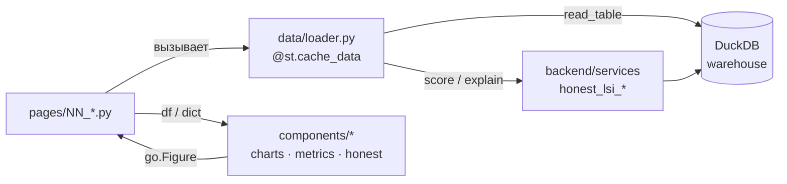

# 🖥️ Frontend — Streamlit Dashboard

Документация слоя **Frontend** системы RU Liquidity Sentinel: архитектура, страницы, взаимодействие с бэкендом и **best practices** для разработчика.

> TL;DR: страницы Streamlit **только читают** готовые данные через тонкий слой `dashboard/data/loader.py` (кеш + витрина DuckDB) и рисуют их переиспользуемыми компонентами из `dashboard/components/`. Никакой тяжёлой логики в UI.

---

## 1. Архитектура

Фронтенд — это **multipage-приложение Streamlit**, собранное через `st.navigation`. Точка входа — `dashboard/app.py`.

```
dashboard/
├── app.py                  # точка входа: навигация, секции, глобальный CSS
├── config.py               # пути к данным, палитра, ярлыки модулей, тема Plotly
├── data/
│   └── loader.py           # ⭐ единственный мост к бэкенду (кешированные загрузчики)
├── components/             # чистые функции-виджеты (возвращают go.Figure / рисуют в st)
│   ├── charts.py           # line_chart, bar_chart, mad_score_bar, event_scatter, ...
│   ├── metrics.py          # KPI-карточки, freshness_header, quick_period_filter, ...
│   └── honest.py           # honest_driver_panel + подписи honest-признаков
└── pages/                  # страницы (по одной на файл, нумерованный префикс)
    ├── 00_combined_signals.py
    ├── 01_overview.py
    ├── 02_m1_reserves.py … 06_m5_liquidity.py
    ├── 07_data_quality.py
    ├── 08_analyst.py
    └── 09_data_update.py
```

### Поток данных



**Ключевой принцип:** страница **не читает файлы и не вызывает модель напрямую**. Она обращается только к функциям `loader.py`, а те — к витрине DuckDB и сервисам бэкенда. Это даёт единый кеш, единый источник данных и тестируемость (любую страницу можно прогнать через `streamlit.testing.v1.AppTest`).

### `app.py` — навигация

Страницы регистрируются как `st.Page` и группируются в секции через `st.navigation`:

```python
overview = st.Page(str(pages_dir / "01_overview.py"), title="Обзор системы", icon="🏠")
data_update = st.Page(str(pages_dir / "09_data_update.py"), title="Данные", icon="⚙️")

pg = st.navigation({
    "Главная":     [overview, signals],
    "Модули":      [m1, m2, m3, m4, m5],
    "Инструменты": [quality, data_update],
    "Аналитика":   [analyst],
})
pg.run()
```

---

## 2. Страницы

| # | Файл | Что делает | Загрузчики |
|---|------|-----------|-----------|
| 🏠 | `01_overview.py` | LSI Local/Global, светофор, выбор порогового профиля, вклады модулей, графики динамики | `load_lsi`, `load_lsi_response`, `dataset_summary`, `load_threshold_*` |
| 📡 | `00_combined_signals.py` | сигналы M1–M5 + LSI на одной оси | `load_lsi`, `load_final`, `load_threshold_profile` |
| 🏦📋📜📅💧 | `02…06_*` | страницы модулей: honest-драйверы + сырой контекст + live-вклад в LSI | `load_mN`, `load_honest`, `load_module_contribution` |
| 🔍 | `07_data_quality.py` | свежесть и полнота по модулям | `dataset_summary`, `load_mN` |
| ⚙️ | `09_data_update.py` | обновление источников → пересчёт → витрина | `wh.manifest`, `refresh_pipeline` |
| 🧠 | `08_analyst.py` | автокомментарий + Q&A (rule-based / LLM) | `lsi_commentary_service` |

### Анатомия страницы модуля (шаблон)

Все страницы M1–M5 построены по одному шаблону:

1. **native + honest данные** — `load_mN()` (нативная гранулярность) и `load_honest()` (дневная, «как видит индекс»);
2. **один фильтр периода** — `quick_period_filter(df_honest, key="mN_period")`, тем же окном режется native;
3. **KPI-строка** — `latest_value_metric` / `mad_status_metric`;
4. **live-вклад в LSI** — `honest_driver_panel(load_module_contribution("MN"))`;
5. **honest-драйверы** (daily) и **сырой контекст** (native) — графики из `components/charts.py`;
6. **таблица + CSV-выгрузка** — `csv_download_button`.

---

## 3. Взаимодействие с бэкендом

Весь обмен идёт через `dashboard/data/loader.py`. Это **API фронтенда к бэкенду**.

### Загрузчики таблиц (читают витрину DuckDB)

| Функция | Возвращает | Источник |
|---------|-----------|----------|
| `load_m1()…load_m5()` | `DataFrame` признаков модуля | `warehouse.read_table("mN_features")` |
| `load_final()` | `final_ml_dataset` | `warehouse.read_table("final_ml_dataset")` |
| `load_honest()` | honest-датасет (драйверы LSI) | `warehouse.read_table("honest_ml_dataset")` |
| `dataset_summary()` | метаданные по всем модулям (строки, даты, пропуски) | все `load_mN` |

Под капотом каждая обёрнута в `@st.cache_data(ttl=3600)` и приводит дату единым парсером `_parse_dates` (ISO → `DD-MM-YYYY` → dayfirst).

### Загрузчики LSI (вызывают сервисы + объяснимость)

| Функция | Возвращает | Контракт |
|---------|-----------|----------|
| `load_lsi()` | `DataFrame` с колонками `lsi`, `lsi_local`, `lsi_global`, `LSI_Index`, `LSI_Local`, `LSI_Global`, `date` | для графиков динамики |
| `load_lsi_response(profile)` | `dict` для последней даты | поля ниже |
| `load_module_contribution(module, prefer="local")` | `dict` live-вклада фич модуля | для `honest_driver_panel` |
| `load_threshold_profile(p)` / `load_threshold_metrics()` | конфиг порогов / метрики | светофор |

**Контракт `load_lsi_response`** (что гарантированно есть в словаре):

```python
{
  "date": "2026-05-08",
  "LSI_Index": 14.99, "LSI_Local": 14.99, "LSI_Global": 38.58,
  "status": "...", "local_status": "...", "global_status": "...",
  "local_top_drivers":  ["m1_ruonia_mad_score", ...],   # ⚠️ список СТРОК
  "global_top_drivers": ["m2_short_active30", ...],
  "local_module_contributions":  {"M1": 42.6, "M2": 20.8, "M3": 18.5, "M5": 18.1},
  "global_module_contributions": {"M1": 17.1, ...},
  "threshold_profile": "honest",
  "threshold_green_max": 40.0, "threshold_yellow_max": 60.0,
}
```

> ⚠️ **Важно про контракт:** страница `01_overview.py` рендерит драйверы как `", ".join(local_top_drivers)` — значит это **список строк**, а не словарей. А `*_module_contributions` — словарь с ключами `"M1".."M5"` (M4 отсутствует — это норма, overlay). Меняя backend-функцию, **сохраняйте этот контракт**, иначе страница упадёт.

---

## 4. Best Practices

### 4.1 Добавить новую страницу

1. Создайте `dashboard/pages/NN_my_page.py` с обязательной «шапкой» (Streamlit запускает каждый файл изолированно, поэтому путь к корню добавляем вручную):

```python
import sys
from pathlib import Path
sys.path.insert(0, str(Path(__file__).parent.parent.parent))

import streamlit as st
from dashboard.data.loader import load_final         # данные — только через loader
from dashboard.components.charts import line_chart

st.set_page_config(page_title="Моя страница", layout="wide")
st.title("Моя страница")

df = load_final()
st.plotly_chart(line_chart(df, x="date", y=["lsi"], title="LSI"), use_container_width=True)
```

2. Зарегистрируйте её в `dashboard/app.py`:

```python
my_page = st.Page(str(pages_dir / "NN_my_page.py"), title="Моя страница", icon="✨")
pg = st.navigation({ ..., "Инструменты": [quality, data_update, my_page] })
```

**Правила:** не читайте parquet/CSV напрямую — добавьте загрузчик в `loader.py`. Не считайте модель на странице — вызывайте сервис через loader. Проверяйте страницу через `AppTest`:

```python
from streamlit.testing.v1 import AppTest
assert not AppTest.from_file("dashboard/pages/NN_my_page.py").run().exception
```

### 4.2 Добавить новый загрузчик (метод данных)

В `dashboard/data/loader.py` — всегда через витрину и с кешем:

```python
@st.cache_data(ttl=3600, show_spinner=False)
def load_repo() -> pd.DataFrame:
    return _load_table("repo")        # _load_table = read_table + _parse_dates + sort
```

Если таблицы ещё нет в `warehouse`, добавьте её в `PROCESSED_TABLES` бэкенда (см. [docs/backend](../backend/README_BACKEND.md)) — `read_table` имеет fallback на processed-файл.

### 4.3 Добавить компонент / график

Компоненты — **чистые функции** в `dashboard/components/`. График возвращает `go.Figure` и ничего не рисует сам:

```python
# dashboard/components/charts.py
def my_chart(df, x, y, title="") -> go.Figure:
    fig = go.Figure(go.Scatter(x=df[x], y=df[y], mode="lines"))
    fig.update_layout(title=title, **_base_layout())   # единый стиль
    return fig
```

Виджет (KPI-карточка, панель) может рисовать в `st` напрямую — как `honest_driver_panel` или `latest_value_metric`. Используйте `COLORS`, `PLOTLY_TEMPLATE`, `MODULE_LABELS` из `config.py`, чтобы стиль был единым.

### 4.4 Управление состоянием (`session_state`)

Различайте два механизма:

| Механизм | Для чего | Время жизни |
|----------|----------|-------------|
| `@st.cache_data` | **результаты вычислений** (данные, скоринг) | TTL=3600, общий на всех пользователей |
| `st.session_state` | **выбор пользователя** (профиль, фильтр) | сессия одного пользователя |

**Паттерн общего выбора между страницами** — на примере порогового профиля. Виджет с `key=` автоматически пишет значение в `session_state[key]`; другие страницы читают его оттуда:

```python
# 01_overview.py — пользователь выбирает профиль
selected = st.radio("Профиль", options, key="lsi_threshold_profile")

# 00_combined_signals.py / 08_analyst.py — читают тот же выбор
profile = st.session_state.get("lsi_threshold_profile", DEFAULT_THRESHOLD_PROFILE)
```

**Правила session_state:**
- инициализируйте безопасно: `if st.session_state.get(key) not in valid_options: st.session_state[key] = default;`
- ключ виджета (`key="..."`) — это и есть имя в `session_state`, не дублируйте присваивание вручную;
- `quick_period_filter(df, key=...)` уже хранит выбор периода в `session_state` — давайте каждому экземпляру **уникальный key** (`"m1_period"`, `"m2_period"`, …), иначе фильтры «слипнутся».

**Сброс кеша после обновления данных.** Страница «Данные ⚙️» после пересчёта вызывает `st.cache_data.clear()` — это заставляет все загрузчики перечитать витрину. Если вы пишете свою операцию, меняющую данные, сделайте то же самое.

---

## 5. Конвенции

- **Тёмная тема:** `PLOTLY_TEMPLATE = "plotly_dark"`, палитра — `COLORS`.
- **Ярлыки модулей:** `MODULE_LABELS["m1"] = "M1 — Резервы"` (ключи в нижнем регистре).
- **Свежесть и период:** `freshness_header(df, name)` и `quick_period_filter(df, key)` из `components/metrics.py` — используйте их, а не свои реализации.
- **Гранулярность:** honest-драйверы показываем на дневной шкале (вход в LSI), сырой контекст — в нативной (периоды/события), с явной подписью.
- **Порог MAD-стресса:** `MAD_STRESS_THRESHOLD = 2.0` (для подсветки баров и сигналов).
```
