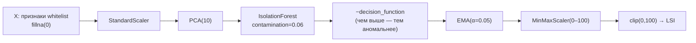

# 🧠 ML — Liquidity Stress Index

Подробная документация ML-слоя: алгоритм, обучение Global/Local, подача признаков, добавление новой фичи и объяснимость (EVR-attribution).

> Код: `backend/src/services/lsi_training_service.py` (ядро), `honest_lsi_training.py` (обучение), `honest_lsi_prediction.py` (скоринг + объяснимость), `honest_feature_builder.py` (признаки + whitelist).

---

## 1. ML-пайплайн

LSI — это **детектор аномалий без учителя**. Стресс не размечается вручную; модель учит «нормальную» геометрию рынка и отмечает редкие/нетипичные состояния. Один и тот же конвейер применяется к двум окнам обучения (Global и Local).



### Зачем каждый шаг

| Шаг | Что делает | Почему именно так |
|-----|-----------|-------------------|
| **StandardScaler** | Z-нормализация по каждому признаку | признаки разномасштабны (млрд руб., %, флаги 0/1). Без нормализации PCA и расстояния в Isolation Forest захватили бы только «крупные» по модулю фичи |
| **PCA(10)** | проекция на 10 главных компонент | убирает мультиколлинеарность (резервы/ставки/аукционы коррелируют) и сжимает сигнал в оси максимальной дисперсии = «оси напряжённости рынка». `n_components = min(10, n_features, n_rows)` |
| **IsolationForest** (`contamination=0.06`, `random_state=42`) | сырой балл аномальности | деревья изоляции: аномалии отрезаются меньшим числом случайных сплитов. Без учителя, устойчив к высокой размерности. `contamination=0.06` = ожидаем ~6% «стрессовых» наблюдений |
| **−decision_function** | инверсия знака | у sklearn `decision_function` выше = «нормальнее». Берём минус, чтобы **выше = более стрессово** |
| **EMA (α=0.05)** | экспоненциальное сглаживание (`adjust=False`) | индекс должен реагировать на тренд, а не на однодневный выброс. α=0.05 ≈ окно ~40 дней «памяти» |
| **MinMaxScaler(0–100)** + **clip** | человекочитаемая шкала | фиксированная шкала 0–100 для светофора. `clip` страхует от выхода за границы при скоринге будущих точек |

### Артефакт модели

`fit_lsi_artifact()` возвращает (и `joblib`-сохраняет) словарь — всё, что нужно для воспроизводимого скоринга:

```python
{
  "features_list": [...],     # порядок колонок, в котором обучался scaler
  "scaler": StandardScaler, "pca": PCA, "iso_forest": IsolationForest,
  "minmax_scaler": MinMaxScaler, "ema_alpha": 0.05,
  "train_start": ..., "train_end": ..., "training_rows": ...,
  "contamination": 0.06, "random_state": 42, "pca_components": 10,
}
```

> ⚠️ **`features_list` — часть контракта.** Скоринг строит матрицу строго в этом порядке (`data[features_list]`). Любое расхождение набора/порядка колонок между обучением и скорингом ломает результат.

Константы — в `lsi_training_service.py`: `PCA_COMPONENTS=10`, `CONTAMINATION=0.06`, `EMA_ALPHA=0.05`, `RANDOM_STATE=42`, `LOCAL_WINDOW_DAYS=365`, `MIN_LOCAL_ROWS=120`, `MIN_LSI_FEATURES=10`.

---

## 2. Global vs Local

Две модели на одном пайплайне, но на разных окнах и разных whitelist'ах.

| | 🌍 **Global** | 📍 **Local** |
|---|--------------|--------------|
| Окно обучения | вся история (с 2014) | скользящие **365 дней** |
| Whitelist | `GLOBAL_WHITELIST` (25 фич) | `LOCAL_WHITELIST` (26 фич = Global + `m5x_rk_bidders`) |
| Смысл | «абсолютный», исторически откалиброванный уровень | чувствительность к аномалиям **относительно недавнего режима** |
| Где обучается | `fit_lsi_artifact(data, kind="global", feature_list=GLOBAL_WHITELIST)` | `fit_lsi_artifact(local_data, kind="local", window_days=365, feature_list=LOCAL_WHITELIST)` |

```python
# honest_lsi_training.build_honest_lsi_models()
global_artifact, _ = fit_lsi_artifact(data, kind="global", feature_list=GLOBAL_WHITELIST)

latest = data["date"].max()
local_data = data[data["date"] >= latest - pd.Timedelta(days=365)]
local_artifact, _ = fit_lsi_artifact(local_data, kind="local",
                                     window_days=365, feature_list=LOCAL_WHITELIST)
```

**Почему `rk_bidders` только в Local.** Число заявителей на аукционах Росказна доступно лишь на свежем окне; на полной истории оно разрежено/отсутствует и зашумило бы Global. Поэтому kind-aware whitelist: единственное отличие Local от Global — добавленный `m5x_rk_bidders`.

**Итоговый индекс.** В дашборде `LSI_Index = Local ⊕ Global`: берётся Local там, где он определён (дата ≥ `train_start` локальной модели), иначе Global. Local скорится **только на своём окне** (EMA считается по окну, не по всей истории) — так значение совпадает с тем, на чём обучалась модель.

---

## 3. Признаки и whitelist

### Как признаки подаются в модель

```python
X = data[features_list].astype(float).fillna(0).to_numpy()
```

- **порядок** колонок задаётся `features_list` (из whitelist);
- **пропуски → 0** (`fillna(0)`): для разреженных событий (нет аукциона) и для дат до появления источника. Это сознательно — «нет события» кодируется нулём после Z-нормализации;
- только **числовые** признаки; нечисловые в whitelist игнорируются (`fit_lsi_artifact` фильтрует по `select_dtypes(number)`).

### Что такое whitelist

Whitelist — **единственное** место, определяющее, *что входит в индекс*. Живёт в `honest_feature_builder.py`:

```python
M1_FEATURES = ["m1_spread_mad_score", "m1_spread_relative_mad_score",
               "m1_reserve_load_mad_score", "m1_ruonia_mad_score", "m1_spread_vol"]      # 5
M2_FEATURES = ["m2_auction_flag", "m2_Flag_Demand", "m2_base_cover_mad",
               "m2_cutoff_spread", "m2_cutoff_spread_available",
               "m2_short_active30", "m2_days_since_short"]                                # 7
M3_FEATURES = ["m3_auction_flag", "m3_Flag_Nedospros", "m3x_cover", "m3x_placement",
               "m3x_yield_to_key", "m3x_age", "m3x_available",
               "m3x_days_since", "m3x_failed"]                                            # 9
M5_GLOBAL_FEATURES = ["m5x_claims", "m5x_liab", "m5x_repostd", "m5x_secured"]             # 4
M5_LOCAL_ONLY      = ["m5x_rk_bidders"]                                                   # +1

GLOBAL_WHITELIST = M1_FEATURES + M2_FEATURES + M3_FEATURES + M5_GLOBAL_FEATURES   # 25
LOCAL_WHITELIST  = GLOBAL_WHITELIST + M5_LOCAL_ONLY                               # 26
```

> 🧭 **M4 — overlay, не в whitelist.** Налоговый календарь детерминирован; включённый в PCA, он давал ложную сезонную подсветку. Поэтому M4-признаки **не входят** ни в один whitelist и не двигают индекс — отдаются как контекст рядом с LSI.

«Честный» принцип отбора: в whitelist попадает только то, что несёт **независимый сигнал стресса**. Производные/«подсказывающие» фичи (готовые композитные сигналы, знаковые дельты) исключены, недостающие добавлены (напр. `m1_spread_vol` — волатильность спреда). Итоговый баланс вкладов: **M1≈23% · M2≈26% · M3≈30% · M5≈20%**.

---

## 4. 🛠️ Как добавить новую фичу в модель

Сквозной путь от расчёта до обучения:

1. **Посчитать признак** в нужном feature-builder. Если это новая «сырая» honest-фича — в `honest_feature_builder.build_honest_dataset()`; если это признак модуля — в `services/mN_feature_builder.py` (и затем он попадёт в `final_ml_dataset`, на котором строится honest-датасет).

2. **Дать имя с правильным префиксом** — `m1_…/m2_…/m3_…/m5x_…`. Префикс определяет принадлежность модулю в объяснимости (`feature[:2].upper()`), поэтому он обязателен.

3. **Добавить имя в whitelist** в `honest_feature_builder.py`:
   - в индекс для обеих моделей → в `M1_FEATURES/M2_FEATURES/M3_FEATURES/M5_GLOBAL_FEATURES`;
   - только в Local → в `M5_LOCAL_ONLY` (паттерн «свежий, разреженный признак»);
   - просто контекст для UI → **не добавлять** в whitelist.

4. **Пересобрать данные и переобучить:**

```bash
python -m backend.src.pipelines.honest_lsi_pipeline   # honest-датасет + Global/Local
python -m backend.src.db.warehouse                     # обновить витрину
```

5. **Проверить.** Убедитесь, что `artifact["features_list"]` содержит новую колонку, и что баланс вкладов не «съехал» (один признак не должен давать >50%). Полезно прогнать честный point-in-time бэктест: `backend/src/services/honest_lsi_backtest.py`.

> ⚠️ **Чек-лист совместимости.** Whitelist при обучении и при скоринге обязан совпадать. После добавления фичи **переобучите модели** — иначе сохранённый `features_list` старой модели не найдёт новой колонки (или наоборот), и скоринг упадёт. `MIN_LSI_FEATURES=10` — нижняя граница: whitelist не может быть короче.

---

## 5. Объяснимость (Explainability)

LSI прозрачен: для любой даты видно, **какой модуль и какой признак** двигают индекс. Метод — **EVR-attribution** (attribution через explained variance ratio). Это PCA-приближение нагрузки, **не SHAP и не причинность**.

### Шаг 1. Структурные веса признаков

Насколько каждый признак «весит» в геометрии главных компонент:

```python
def _structural_weights(pca):
    # |loadings|ᵀ · explained_variance_ratio  → вектор длины n_features
    return np.abs(pca.components_).T @ pca.explained_variance_ratio_
```

Идея: признак важен, если у него большие нагрузки (`components_`) в компонентах с большой объяснённой дисперсией (`explained_variance_ratio_`).

### Шаг 2. Вклад признака в точке

```python
scaled = scaler.transform(X)        # Z-оценки строки (отклонение от нормы)
contrib = np.abs(scaled[idx]) * structural_weights
pct = contrib / contrib.sum() * 100  # нормировка к 100% по всем признакам индекса
```

- **`z_scaled`** = `scaled[j]` — насколько признак отклонён от своей нормы (в стандартных отклонениях); знак даёт **направление** («выше/ниже нормы»);
- **`contrib_pct`** = доля признака в суммарной нагрузке строки (сумма по всем фичам = 100%).

### Шаг 3. Агрегации

| Что | Как считается | Где в коде |
|-----|---------------|-----------|
| **Топ-драйверы** | сортировка `pct` по убыванию, top-N | `honest_drivers()` |
| **Вклад модуля** | сумма `pct` по фичам с префиксом модуля (M1/M2/M3/M5) | `honest_module_contributions()` |
| **Вклад фичи модуля (для страницы)** | те же `pct`, отфильтрованные по модулю | `honest_module_feature_contributions()` |
| **Декомпозиция по компонентам** | для PC1–PC3: `evr%`, активация `z=(score−μ)/σ`, топ-loadings, доминирующий модуль | `honest_components()` |

### Связь со скорингом

EVR-attribution объясняет **геометрию входа** (что аномально в данной строке), а не пошагово раскладывает финальный балл Isolation Forest. Поэтому в UI явно подписано: «PCA-приближение нагрузки, не SHAP, не причинный вклад». Для каждой даты доступны: значение LSI, статус светофора, топ-драйверы (строки-имена фич), вклады модулей (dict `M1..M5`), декомпозиция PC1–PC3.

---

## 6. Артефакты, переобучение, бэктест

- **Артефакты:** `models/honest_lsi_global_pipeline.joblib`, `models/honest_lsi_local_pipeline.joblib` (+ legacy `lsi_*`).
- **Переобучение:** `python -m backend.src.pipelines.honest_lsi_pipeline` (или кнопка «Данные ⚙️ → Полное обновление», которая пересчитывает фичи и переобучает модели).
- **Честный бэктест:** `honest_lsi_backtest.py` — point-in-time (Global expanding, Local rolling 365д), без look-ahead. Эпизоды: Декабрь 2014, Февраль–март 2022, Август 2023. Калибровка порогов реализована в коде: `backend/src/services/lsi_threshold_calibration_service.py`. Помодульные разборы — в [`../modules/`](../modules/).

---

## 7. Пороговые профили

Числовой LSI переводится в светофор порогами (`lsi_thresholds.py`). Сами числа не меняются — меняется только интерпретация:

| Профиль | 🟢 | 🟡 | 🔴 |
|---------|----|----|----|
| `honest` *(default)* | < 40 | 40–60 | ≥ 60 |
| `conservative` | < 40 | 40–70 | ≥ 70 |

`honest` откалиброван под сбалансированный индекс (≈ перцентили p80/p95 honest-Global).
